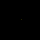

## Overview

This is a reproduction of implementation of [Growing Neural Cellular Automata](https://research.google/pubs/pub48963/) by Mordvintsev et al., 2020 and [Goal-Guided Neural Celluar Automata: Learning to Control Self-Organising Systems](https://arxiv.org/abs/2205.06806) by Sudhakaran et al., 2022 using Pytorch and Pytorch Lightning.

### Target channels visualization




### Alive channel visualization


### Monitoring training progress via Tensorboard

You can visualize the best seed (seed with the best loss or most closely resembles the target image) for each step as well as test run of a random seed in Tensorboard.


## Usage

### Setup

First, clone this repository using `git`:

```bash
git clone https://github.com/outday29/nca
```

After that, install the required dependencies in the `requirements.txt`. You are encouraged to create a virtual environment before doing so.

```bash
pip install -r requirements.txt
```

Then download the emoji pictures for the NCA to grow by running `download_dataset.py`,

```bash
python download_dataset.py
```

### Examples

Below are the notebooks that demonstrate how to train different neural cellular automata:

- `growing_nca.ipynb` for NCA found in Growing Neural Cellular Automata (Mordvintsev et al., 2020)
- `goal_nca.ipynb` for NCA found in Goal-Guided NCA (Sudhakaran et al., 2022)